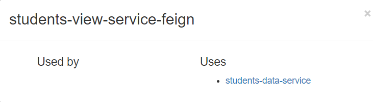
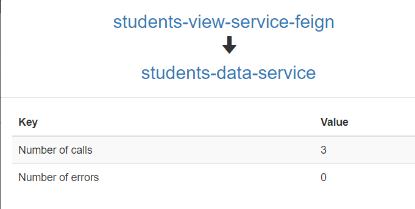

依次运行
1. zipkin-server文件夹中的jar文件(java -jar)
2. eurekaserver主类
3. students-data-service两次或多次
4. students-view-service-feign一次
5. 查看 http://127.0.0.1:8012/students 刷新几次 查看每次调用的不同服务(端口)
6. http://localhost:9411/zipkin/ 访问Find Traces,再查看依赖分析http://localhost:9411/zipkin/dependency/
7. 使用config-server,就启动config-server的启动类

  
看到使用者是 Used by (所使用) , Uses (使用)  
  
也就是说 students-data-service 服务使用了 students-view-service-feign 来作为客户端负载均衡.  